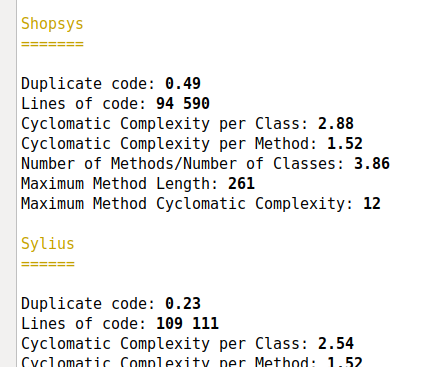

# Code Complexity of [Shopsys](https://www.shopsys-framework.com/), [Spryker](https://spryker.com/) & [Sylius](http://sylius.org/)

[](https://travis-ci.org/TomasVotruba/shopsys-spryker-and-sylius-analysis)

You can find nice summary of these metrics 2 posts:

- [Shopsys, Spryker & Sylius under Static Analysis](https://www.tomasvotruba.cz/blog/2017/08/28/shopsys-spriker-and-sylius-under-static-analysis/) (2017-08)
- [EasyCodingStandard and PHPStan meet 3 Symfony E-Commerce Projects](https://www.tomasvotruba.cz/blog/2017/10/02/easy-coding-standard-and-phpstan-meet-3-symfony-ecommerce-projects/) (2017-10)

To be sure we're not making them up, you can **run them yourself on you local machine**:


## 1. Install

[Spryker](https://spryker.com/) requires few extra PHP extensions. Here is how you add them:
 
**On Linux**
  
```bash
sudo apt-get install php-bcmath php-gmp php-redis php-bz2
```

### Install this Repository

Then you can install this repository:

```bash
git clone https://github.com/TomasVotruba/shopsys-spryker-and-sylius-analysis.git ecommerce-analysis
cd ecommerce-analysis
composer install
```

### Download Projects

As project have dependencies in conflict, they have to be cloned to **own directories**.
This command downloads all projects to `/project` directory and runs `composer install` on them.

```bash
bin/run prepare
```

## 2. Run Analysis

```bash
bin/run analyze
```

Or limit it to single project:

```bash
bin/run analyze --project shopsys 
```

And it will print this nice summary for every project:




### Easy Coding Standard

This will check coding standards of project with [`psr2.yml`](/config/ecs/psr2.yml) and [`clean-code.yml`](/config/ecs/clean-code.yml) sets:

```bash
bin/run ecs
```

### PHPStan

This will run and show number of errors per level:

```bash
bin/run phpstan
```

And it will print summary for every project:


